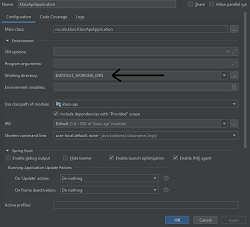

[](https://codeclimate.com/github/statisticsnorway/klass/maintainability)
[](https://github.com/statisticsnorway/klass/actions/workflows/codeql-analysis.yml)

# KLASS

Spring Boot applications that handles classifications for SSB.
Klass provides a REST api that clients can use to read classifications, and a Vaadin frontend for maintaining classifications.

## Overview

Klass consists of 4 maven modules

- Klass API (Standalone application that provides the Klass API)
- Klass Forvaltning (Frontend for classification maintaining)
- Klass Shared (Classes shared between API and Forvaltning. primary database and search components)
- Klass Solr (Solr Core configuration and configuration for embedded solr for test/development)

## Build and Deploy

Building the project will output war files for **Klass API** & **Klass Forvaltning** and a zip file (WiP) for **Klass Solr**.

You can find these in each maven modules target folder.

```
klass-api/target/klass-api-{Version}.war
klass-forvaltning/target/klass-forvaltning-{Version}.war
klass-solr/klass-solr-{Version}.zip (WiP)
```

## Server configuration

Klass was made with Tomcat in mind and configuration on servers are done in `tomcat.conf` (usually found in ~tomcat/conf)
variables in `application properties` will be overridden/replaced with properties found in `tomcat.conf`
ex. the value for `klass.env.mariadb.password` will be replaced with the value from `KLASS_ENV_MARIADB_PASSWORD`.

please note that `.` is replaced with `_` in the tomcat config.

A typical `tomcat.conf` would contain the following

```
SPRING_PROFILES_ACTIVE=mariadb
KLASS_ENV_MARIADB_INSTANCE=mysql-server
KLASS_ENV_MARIADB_PASSWORD=Password
KLASS_ENV_LOGGING_PATH=/var/log/tomcat
```

## Database

Klass is configured to use Flyway for database initialising and migration.
You can find the collection of SQL scripts in the Klass-shared module under `src/main/resources/db/migration`

If the classification tables are empty Klass will by default attempt to import data from its predecessor.
This process can take quite some time as there is a lot of data and its also sent to Solr to populate the search index.

Tips: If you are only setting up Klass for testing/development purposes you can use the `small-import` spring profile to reduce the amount of data being imported.

## Development

### Requirements

- Maven: <https://maven.apache.org/install.html>
- Sdkman: <https://sdkman.io/install>
- Java 17: `sdk install java 17.0.15-tem`
- Java 8 (for Klass Forvaltning): `sdk install java 8.0.452-tem`

### Configuration

In order to download dependencies from GitHub Packages we must authenticate Maven. See the documentation here: <https://docs.github.com/en/packages/working-with-a-github-packages-registry/working-with-the-apache-maven-registry#authenticating-with-a-personal-access-token>

This may be done by generating a Personal Access Token (classic) on GitHub with the `read:packages` scope. Remember to configure SSO. The following configuration may then be placed in your `~/.m2/settings.xml` file.

```xml

<servers>
    <server>
        <id>github</id>
        <username>USERNAME</username>
        <password>TOKEN</password>
    </server>
</servers>
```

Colima should have at least 5G memory and the project folder must be mounted. Change this in `~/.colima/default/colima.yaml` e.g.

```yaml
memory: 5
...
mounts:
  - location: /Users/perolsen/Repository/github/klass
    writable: false
```

### Introduction

It's recommended to build with maven before starting development as some classes are generated as part of the build process.

Each app has an `.sdkmanrc` file which may be used to configure the Java version to use. This may be activated by entering the directory and running the `sdk env` command. A `Makefile` is also provided with relevant commands for building each app. See <https://sdkman.io/usage#env-command> for more details

### Klass API

#### Build

Build the app: `make build-klass-api`

#### Docker compose

Service `klass-api` requires a prebuild tagged image.

Run command in `klass-api` module:

```
docker build -t target-postgres-image:latest .
```

This service depends on a Postgresql db container.

For testing with MariaDB build `klass-api` with `klass-shared` version `3.0.5-master-SNAPSHOT`.

This will build klass-api without running tests:

```
mvn clean install -DskipTests -pl klass-api
```

And build mariadb image in klass-api module:

```
docker build -t source-mariadb-image:latest .
```

### Klass Forvaltning

#### Build

`make build-klass-forvaltning`

#### Run

`make run-klass-forvaltning-local`

Visit <http://127.0.0.1:8081/klassui>

### Spring profiles

Klass API and Klass Forvaltning utilize Spring boot and heavily rely on Spring Profiles to make development and debugging easier.
below is a quick summary of the profiles available (see _application.properties_ for more details)

```
# Application profiles:
#----------------------
# Profiles for production
#   production          = no test beans and only Active Directory login
#   mariadb             = use remote mariaDB database
#   remote-solr         = use remote Solr server
#
# Profiles for development
#   ad-offline          = will only use test/embeded AD (apacheDS) [Forvaltning only]
#   small-import        = imports a small number of classifications from legacy system, useful during development
#   mock-mailserver     = outgoing emails are only logged
#   embedded-solr       = run an instance of solr as part of the application (no need to run a separate solr application)
```

### Build profiles

The profile named `documentation` will generate API documentation with AsciiDoc (default: enabled)

### Run / Debug

You can start an application using maven with the following command

```shell
mvn spring-boot:run
```

Start the forvaltning app with

```shell
make run-klass-forvaltning-local
```

Or from your IDE using the `KlassApiApplication` / `KlassForvaltningApplication` classes.
IntelliJ is recommended, it makes it very easy to start spring boot applications and will make sure your run/debug configuration has all the necessary dependencies (will include maven dependencies with provided scope).

Frontend may be accessed at:

<http://localhost:8081/klassui>

REST api documentation may be accessed at

<http://localhost:8081/api/klass/v1/api-guide.html>

## Troubleshooting

### Known issues

#### build fails due to encoding issues(æøå)

Windows defaults to ascii and java/maven/surefire? does for some reason use this even though utf-8 has been specified everywhere.
The current solution to this problem is to add an environment variable `JAVA_TOOL_OPTIONS` with value `-Dfile.encoding=UTF-8` to your system.

#### Application running in intelliJ wont show monitor page or CSS

_Intellij 2019.1_ and earlier does not seem to detect the correct work directory and files placed in the webapp directory might not be available to the application.
the solution is to set workdir manually in your run configuration (set it to `$MODULE_WORKING_DIR$`)

[](./docs/troubleshoot_workdir.png)
